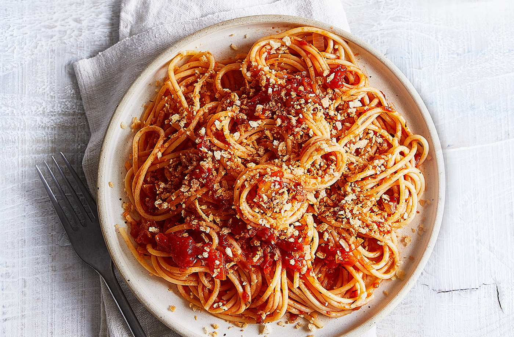

# PASTA

# Introduction

This repository contains the official implementation of the following two papers:

**[1] (CoRL 2022) Planning with Spatial-Temporal Abstraction from Point Clouds for Deformable Object Manipulation**

Xingyu Lin*, Carl Qi*, Yunchu Zhang, Zhiao Huang, Katerina Fragkiadaki, Yunzhu Li, Chuang Gan, David Held

[Website](https://sites.google.com/view/pasta-plan) /  [Paper](https://arxiv.org/abs/2210.15751)

**[2] (ICLR 2022) DiffSkill: Skill Abstraction from Differentiable Physics for Deformable Object Manipulations with
Tools**

Xingyu Lin, Zhiao Huang, Yunzhu Li, Joshua B. Tenenbaum, David Held, Chuang Gan

[Website](https://xingyu-lin.github.io/diffskill/) /  [Paper](https://openreview.net/pdf?id=Kef8cKdHWpP)

# Table of Contents

1. [Installation](#installation-instructions)
2. [Environments](#environments)
3. [Preparation](#preparation)
4. [Training and evaluation of PASTA](#training-and-evaluation-of-pasta)
5. [Notes for DiffSkill](#notes-for-diffskill)
6. [Pretrained models and data](#pretrained-models)

### Installation instructions

1. Install conda environments by running `conda env create -f environment.yml` and activate the conda
   environment: `conda activate plb`.
2. Install [torch (version 1.9.0 tested)](https://pytorch.org/get-started/previous-versions/)
    * We tested `pip install torch==1.9.0+cu111 torchvision==0.10.0+cu111 torchaudio==0.9.0 -f https://download.pytorch.org/whl/torch_stable.html` on RTX 3090.
3. Install packages for computing the EMD loss:
    * [pykeops (1.5)](https://www.kernel-operations.io/keops/python/installation.html) by
      running `pip install pykeops==1.5`
    * [geomloss](https://www.kernel-operations.io/geomloss/api/install.html) by running `pip install geomloss`
4. Install necessary packages for [PointFlow](https://github.com/stevenygd/PointFlow), which we use for encoding point
   clouds into latent space.
5. Run `./prepare.sh` to activate the conda environment and set up the path

### Environments

This code includes the three tasks from the PASTA paper. The visualization shows the execution of the learned planner
and policies.

|                      LiftSpread                       |                      CutRearrange                       |             CutRearrangeSpread (CRS) / CRS-Twice              |
|:-----------------------------------------------------:|:-------------------------------------------------------:|:-------------------------------------------------------------:|
|  |  |  |

* **LiftSpread**: The agent needs to first use a spatula (modeled as a thin surface) to lift a dough onto the cutting
  board and then adopt a rolling pin to roll over the dough to flatten it. The rolling pin is simulated as a 3-Dof
  capsule that can rotate along the long axis and the vertical axis and translate along the vertical axis to press the
  dough.
* **CutRearrange**:  This is a three-step task. Given an initial pile of dough, the agent needs to first cut the dough
  in half using a knife. Inspired by the recent cutting simulation (Heiden et al., 2021), we model the knife using a
  thin surface as the body and a prism as the blade. Next, the agent needs to use the gripper to transport each piece of
  the cut dough to target locations.
* **CutRearrangeSpread (CRS)** This task provides a number of demonstration trajectories performing one of the three
  skills: Cutting with a knife, pushing with a pusher, and spreading with a roller. The demonstration of each skill only
  shows a tool manipulating a single piece of dough.

### Preparation

1. **Environment setup** We need to first generate initial and target configurations for each environment both for
   generating demonstration and for evaluation
    * You can download the pre-generated initial and target configurations by running the following command:
       ``` 
       python run_scripts/download.py --command init_target --env_name CutRearrange-v1
       ```
   Change `CutRearrange-v1` to `LiftSpread-v1` or `CutRearrangeSpread-v1` for other environments. It will be put under
   the `dataset` folder under the project root by default.
    * Alternatively, you can generate the initial and target configurations by
      running `python run_scripts/generate_init_target.sh`. Note that the generated init and target configurations will be saved to the path that you specify as `--save_dir`. After generating the initial and target configurations, you also need to modify the corresponding environment yaml file in `plb/envs/env_ymls/` by replacing the path under `ENV: cached_state_path` to the path of `--save_dir` from your generation script.
2. **Generate demonstration** Given these initial and target configurations, we run gradient-based trajectory optimization (GBTO) to generate the demonstration trajectories. An example run script is `run_scripts/run_gbto.sh`.
   You also need to post-process the demonstration (to get the clusters for spatial abstraction) data by running DBSCAN. This can be done by
   running `run_scripts/run_dbscan.sh`.
    * Alternatively, you can just download the pre-generated (and post-processed) demonstration data by running the following command:
      ```
      python run_scripts/download.py --command demo --env_name CutRearrange-v1
      ```

### Training and evaluation of PASTA

For training PASTA, we sequentailly train the point cloud VAE, the polices, the feasibility and the cost predictors.
Please refer to the specific arguments in the scripts for details.

1. The point cloud VAE [PointFlow](https://github.com/stevenygd/PointFlow) can be trained by
   running 
   ```
   ./PointFlow/scripts/set_<env_name>_gen_dist.sh
   ```
2. The policy networks, which are parameterized by [PointNet++](https://github.com/pyg-team/pytorch_geometric) can be
   trained by running
   ```
   ./run_scripts/pasta_train_policy.sh
   ```
3. Finally, one needs to train PASTA's abstraction modules (feasibility and cost predictors). Make sure you have loaded
   the trained VAE and policies for correct evaluation. You can run
   ```
   ./run_scripts/pasta_train_abstraction.sh
   ```

To plan and execute the PASTA models for evaluation, you can run `run_scripts/pasta_plan.sh`.
See [Pretrained](#pretrained-models) for the pretrained models.

### Notes for DiffSkill

For training DiffSkill, you can train the rgbd VAE, the polices, the feasibility and the cost predictors jointly by 
running
```
./run_scripts/diffskill_train_all.sh
```
* Alternatively, you may first train the rgbd VAE by keeping only `"vae"` in `--train_modules`. 
Then, you can load the pre-trained VAE by adding `--vae_resume_path <PATH TO PRETRAINED VAE MODEL>`.

To plan and execute the PASTA models for evaluation, you can run `run_scripts/diffskill_plan.sh`.
See [Pretrained](#pretrained-models) for the pretrained models.
   

### Pretrained models
All pretrained models can be downloaded in one command:
```
python run_scripts/download.py --command pretrained
```

### Bon Appetit!



## Cite

If you find this codebase useful in your research, please consider citing:

```
@inproceedings{lin2022planning,
title={Planning with Spatial-Temporal Abstraction from Point Clouds for Deformable Object Manipulation},
author={Xingyu Lin and Carl Qi and Yunchu Zhang and Zhiao Huang and Katerina Fragkiadaki and Yunzhu Li and Chuang Gan and David Held},
booktitle={6th Annual Conference on Robot Learning},
year={2022},
url={https://openreview.net/forum?id=tyxyBj2w4vw}
}
```

```
@inproceedings{lin2022diffskill,
title={DiffSkill: Skill Abstraction from Differentiable Physics for Deformable Object Manipulations with Tools},
author={Xingyu Lin and Zhiao Huang and Yunzhu Li and Joshua B. Tenenbaum and David Held and Chuang Gan},
booktitle={International Conference on Learning Representations},
year={2022},
url={https://openreview.net/forum?id=Kef8cKdHWpP}}
}
```
